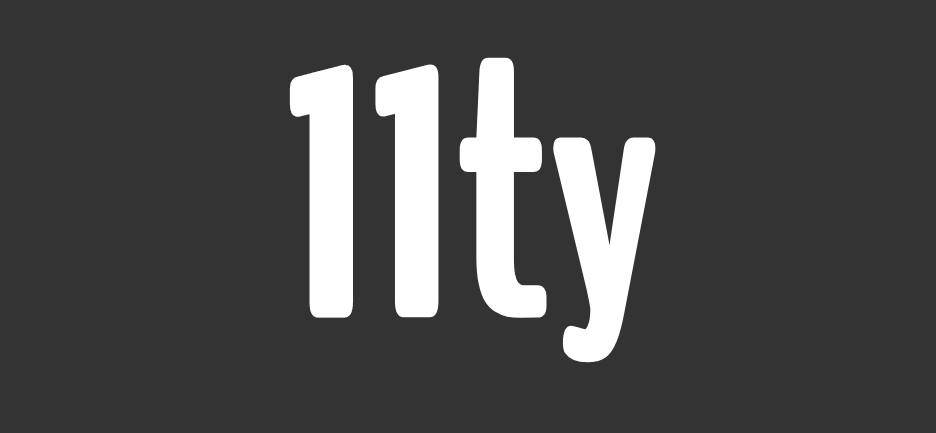
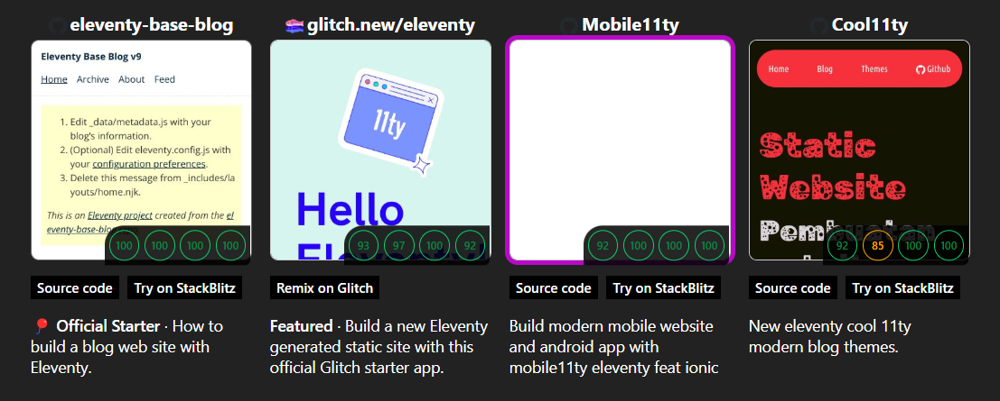
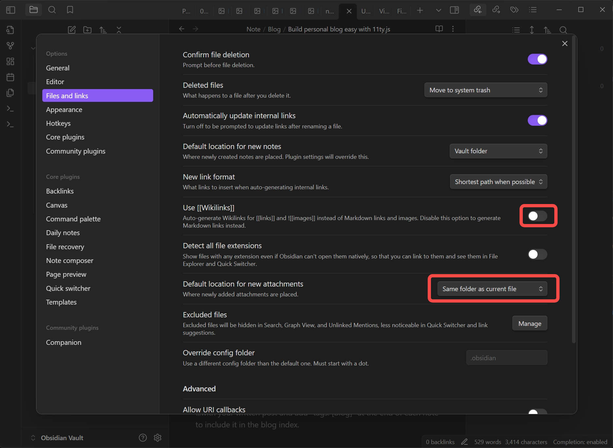
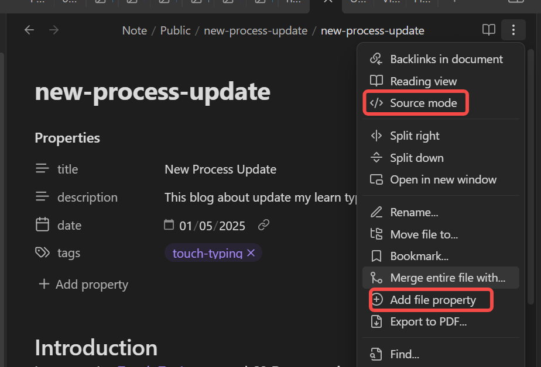

## Introduce
At the end of 2024, after graduating from university, I wanted to build something meaningful using the skills and experience gained from my job. Initially, I planned to create a portfolio, but I wasn’t ready to design it. I also wanted something original rather than combining or copying existing designs. So, I decided to start with a personal blog instead.
## What is Eleventy?
[Eleventy](https://www.11ty.dev/) (or 11ty) is a simple and fast static site generator that allows you to build websites quickly. It supports multiple templating languages, including HTML, Markdown, and Nunjucks. This makes it easy to deliver content quickly to readers while also simplifying deployment and maintenance.

### Why I choose 11ty?
At work, I often use React and Next.js for projects. Some projects utilize Next.js as a headless CMS with WordPress for content delivery. This combination of business logic from Next.js and the powerful content management features of WordPress is very effective.

Initially, I wanted to create a blog using Next.js with Firebase and deploy it on Vercel. This seemed like a good approach for combining a portfolio and a blog.  
**Advantages:**
- **Powerful Static Site Generation:** Next.js could generate static sites efficiently by fetching content from Firebase. This setup would also allow me to write and store blog posts directly.
- **Rich Library Support:** Combining my portfolio and blog into one platform would enable advanced customizations using the Next.js ecosystem.  
**Disadvantages:**
- **Free Tier Limitations:** Vercel's free tier limits deployments to 12 serverless functions, and each Firebase data fetch counts as one. This could be a problem as the site grows.
- **Complexity:** The integration of Next.js with Firebase requires significant time and effort to set up and maintain, which could slow my progress.

I chose 11ty because it’s a simpler static site generator that aligns well with my goal of focusing on blog content.  
**Advantages:**
- **Speed:** Eleventy is incredibly fast, allowing me to deploy a blog quickly.
- **Flexible Templating:** It supports multiple templating languages, which makes customization easy.  
**Disadvantages:**
- **Limited Scope:** Eleventy is primarily suited for blogs and simple static sites. It lacks advanced interactivity and business logic capabilities.
## Start with a [Start Project](# Starter Projects)
When starting an 11ty project, there are many templates available to help you get started quickly. These templates provide pre-configured setups for various use cases, such as blogs, portfolios, and more.

I chose the `Official Starter` template to begin. [Link to the template](https://github.com/11ty/eleventy-base-blog).  
After selecting the "Official Starter" template, I followed the instructions to set up my project. This involved installing dependencies, initializing Git, and running a few commands to get everything up and running.
## How to Write Posts?
I use [Obsidian](https://obsidian.md/) to write posts and sync them to the `content/blog/` directory in my project. Writing in `Markdown` makes it easy to maintain posts. Here’s how I do it in a few steps:
### Step 1: Write the Post in Obsidian
I create a folder in Vault's Obsidian name `public` will store my posts .
Change setting Obsidian a little bit in `File and links`.
- Turn off `Use Wikilinks`, 11ty only render image or link follow the format of `.md` not follow `Obsidian`. 
- Set `Default location for new attachments`: Choose `Same folder as current file`

| **Note:** If a post doesn't contain images, you can create a single Markdown file. For posts with images, create a folder and name it the same as the Markdown file.
#### Metadata for Posts
You can add metadata for post with two ways:
1. **File Property:** Add each property individually in Obsidian.


2. **Source Mode:** Switch the file to source mode and add metadata like this:
```
---
title: New Process Update
description: This blog about update my learn typing touch process
date: 2025-01-05
tags:
  - touch-typing
---
```
| **Tip:** The file name serves as the `slug` for the post, so choose it carefully.

### Step 2: Sync the posts from Obsidian to 11ty source
I use Windows, so I run the following `bash` command in the terminal to sync my posts:
```bash
robocopy "My Vaults Obsidian Public" "\eleventy-sample\content\blog" /MIR

pause
```
After syncing, check and test the build before proceeding to the next step.
## Deployment
11ty is a simple static site generator. Once the site is built, the generated files are stored in the `_site/` directory. You can deploy them using platforms like Vercel, Netlify, and others. Refer to the [11ty Deployment Guide](https://www.11ty.dev/docs/deployment/) for more details.
### Deploying with Netlify
I use Netlify for my project. After signing in with GitHub or GitLab, I added the project to Netlify. The build process automatically starts, and the site is deployed with a subdomain provided by Netlify.
### Adding a Custom Domain
In your 11ty project settings on Netlify, go to **Domain Management** and follow Netlify's instructions to add your custom domain.
## Conclusion
This post shares my experience building a blog site with 11ty. If you notice any errors or have suggestions for improvement, feel free to contact me via [Contact Page](/about).