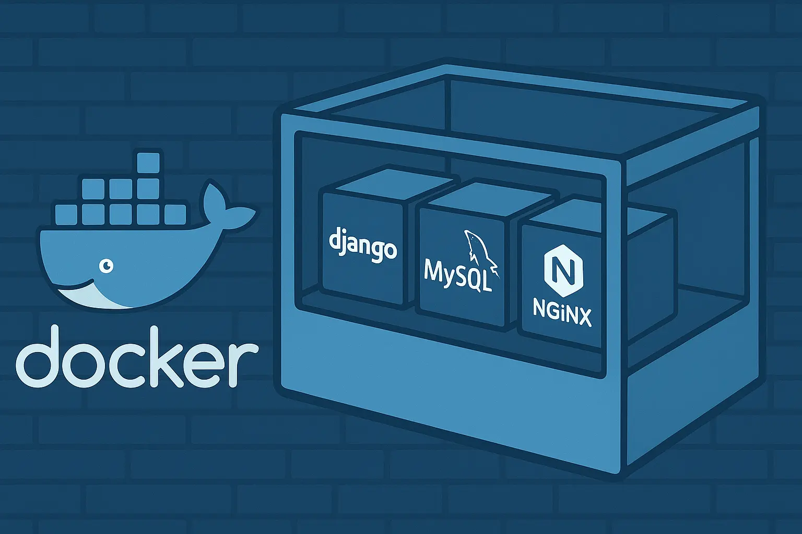

Managing a Django backend in production can be tricky—especially when you need to run a database, background tasks, caching system, and a web server together. Docker and Docker Compose make this easier. They let you define and run all these services in containers that work together.



In this guide, I’ll walk you through how to containerize a Django project using Docker and Docker Compose with multiple services like MySQL, Redis, Celery, and Nginx.

---

## **Outline**

1. Introduction

2. Project Structure Overview

3. Writing the Dockerfile

4. Composing Services with `docker-compose.yaml`

5. Service Breakdown

6. Environment Variables and Secrets

7. Development and Production Tips

8. Running and Testing the Stack

9. Conclusion

10. References

---

## **1. Introduction**

When running Django in production, you need to think about dependencies, performance, and security. Docker helps by putting everything your app needs into containers. Docker Compose allows you to run several containers at the same time—like your Django app, database, task queue, and web server.

---

## **2. Project Structure Overview**

Here’s what the project folder looks like:

```text
.
├── Dockerfile
├── docker-compose.yaml
├── Pipfile
├── Pipfile.lock
├── nginx/
│   └── conf.d/
├── staticfiles/
├── your_project/
│   └── wsgi.py
└── ...
```

- **Dockerfile** – Builds the image for the Django app.

- **docker-compose.yaml** – Defines and manages all containers.

- **nginx/conf.d** – Stores Nginx settings.

- **staticfiles/** – Contains Django static files after running `collectstatic`.

---

## **3. Writing the Dockerfile**

This `Dockerfile` creates a container for your Django project:

```dockerfile
FROM python:3.10-slim

WORKDIR /app

RUN apt-get update && apt-get install -y --no-install-recommends \
    build-essential \
    default-libmysqlclient-dev \
    pkg-config \
    curl \
 && apt-get clean \
 && rm -rf /var/lib/apt/lists/*

RUN pip install --no-cache-dir pipenv

COPY Pipfile Pipfile.lock ./
RUN pipenv install --deploy --system && pip uninstall -y pipenv virtualenv-clone virtualenv

COPY . .

RUN python manage.py collectstatic --noinput

CMD ["gunicorn", "--bind", "0.0.0.0:8000", "your_project.wsgi:application"]
```

**Main steps explained:**

- Uses a small Python image.

- Installs tools and libraries for Django and MySQL.

- Installs Python packages using Pipenv.

- Copies project files into the container.

- Collects static files for Nginx to serve.

- Starts the app using Gunicorn, a reliable web server for Python apps.

---

## **4. Composing Services with** `**docker-compose.yaml**`

The `docker-compose.yaml` file brings all the services together:

```docker-compose.yaml
version: "3.8"

services:
  db:
    image: mysql:8.0
    restart: always
    volumes:
      - db_data:/var/lib/mysql
    environment:
      - MYSQL_ROOT_PASSWORD=${MYSQL_ROOT_PASSWORD}
      - MYSQL_DATABASE=${MYSQL_DATABASE}
      - MYSQL_USER=${MYSQL_USER}
      - MYSQL_PASSWORD=${MYSQL_PASSWORD}
    command: --default-authentication-plugin=mysql_native_password
    healthcheck:
      test: ["CMD", "mysqladmin", "ping", "-h", "localhost"]
      interval: 10s
      timeout: 5s
      retries: 5

  web:
    build: .
    restart: always
    depends_on:
      db:
        condition: service_healthy
      redis:
        condition: service_started
    environment:
      - DATABASE_URL=mysql://${MYSQL_USER}:${MYSQL_PASSWORD}@db:3306/${MYSQL_DATABASE}
      - REDIS_URL=redis://redis:6379/0
      - DEBUG=${DEBUG:-True}
      - SECRET_KEY=${SECRET_KEY}
      - ALLOWED_HOSTS=${ALLOWED_HOSTS:-localhost,127.0.0.1}
    volumes:
      - ./staticfiles:/app/staticfiles
    healthcheck:
      test: ["CMD", "curl", "-f", "http://localhost:8000/health/"]
      interval: 30s
      timeout: 10s
      retries: 3

  celery:
    build: .
    command: celery -A your_project worker -l INFO
    restart: always
    depends_on:
      db:
        condition: service_healthy
      redis:
        condition: service_started
    environment:
      - DATABASE_URL=mysql://${MYSQL_USER}:${MYSQL_PASSWORD}@db:3306/${MYSQL_DATABASE}
      - REDIS_URL=redis://redis:6379/0
      - DEBUG=${DEBUG:-True}
      - SECRET_KEY=${SECRET_KEY}
    volumes:
      - ./staticfiles:/app/staticfiles

  celery-beat:
    build: .
    command: celery -A your_project beat -l INFO
    restart: always
    depends_on:
      db:
        condition: service_healthy
      redis:
        condition: service_started
    environment:
      - DATABASE_URL=mysql://${MYSQL_USER}:${MYSQL_PASSWORD}@db:3306/${MYSQL_DATABASE}
      - REDIS_URL=redis://redis:6379/0
      - DEBUG=${DEBUG:-True}
      - SECRET_KEY=${SECRET_KEY}
    volumes:
      - ./staticfiles:/app/staticfiles

  redis:
    image: redis:7
    restart: always
    healthcheck:
      test: ["CMD", "redis-cli", "ping"]
      interval: 10s
      timeout: 5s
      retries: 5

  nginx:
    image: nginx:1.23
    restart: always
    ports:
      - "${NGINX_HTTP_PORT:-80}:80"
      - "${NGINX_HTTPS_PORT:-443}:443"
    volumes:
      - ./nginx/conf.d:/etc/nginx/conf.d
      - ./staticfiles:/var/www/html/static
      - /etc/letsencrypt:/etc/letsencrypt:ro
    depends_on:
      web:
        condition: service_healthy

volumes:
  db_data:
```

- **db** – MySQL database

- **web** – Django app

- **celery** – Celery worker for background jobs

- **celery-beat** – Schedules recurring tasks

- **redis** – Used for caching and as a Celery broker

- **nginx** – Serves static files and acts as a reverse proxy

---

## **5. Service Breakdown**

### **Database (MySQL)**

- Uses the `mysql:8.0` image.

- Data is stored in a Docker volume so it won’t be lost when containers stop.

- Environment variables are used to set username, password, and database name.

- A healthcheck waits until MySQL is ready before other services start.

### **Django Web App**

- Built from the Dockerfile.

- Depends on `db` and `redis`.

- Uses environment variables for setup (like DB connection and Redis).

- Mounts the `staticfiles` folder for serving assets.

- A healthcheck checks the `/health/` endpoint.

### **Celery & Celery Beat**

- Both use the same image as the Django app.

- `celery` handles background tasks.

- `celery-beat` schedules repeating jobs.

- Both need the database and Redis.

- Share the same environment setup.

### **Redis**

- Uses the official `redis:7` image.

- Acts as an in-memory database and message broker.

- Healthcheck makes sure Redis is running properly.

### **Nginx**

- Works as a reverse proxy and static file server.

- Forwards requests to Django and serves static assets.

- Starts only after the Django app passes its healthcheck.

---

## **6. Environment Variables and Secrets**

Use environment variables to keep sensitive info out of your code. Store them in a `.env` file and load them in `docker-compose.yaml`.

Example variables:

- `MYSQL_USER`, `MYSQL_PASSWORD`, `MYSQL_DATABASE`

- `DATABASE_URL`, `REDIS_URL`

- `DEBUG`, `SECRET_KEY`, `ALLOWED_HOSTS`

Never commit your `.env` file to version control (like GitHub).

---

## **7. Development and Production Tips**

- In **development**, mount your project as a volume to auto-reload code, and set `DEBUG=True`.

- In **production**, set `DEBUG=False` and use a secure `SECRET_KEY`.

- Run `collectstatic` during the Docker build so Nginx can serve static files.

- Run migrations after all services are up.

---

## **8. Running and Testing the Stack**

### 1. **Build and Start:**

```bash
docker compose up -d
```

### 2. **Run Migrations:**

```bash
docker compose exec web python manage.py migrate
```

### 3. **Open Your App:**

- Visit `http://localhost` in your browser.

- Static files are served by Nginx.

- Celery and Celery Beat run in the background.

### 4. **Check Status:**

```bash
docker-compose ps
```

Each container should show a healthy status if running correctly.

---

## **9. Conclusion**

Containerizing a Django backend with Docker makes it easier to build, test, and deploy your app. By breaking your system into services—like the database, task queue, and web server—you can manage and scale each part independently.

Using Docker Compose, you can spin up the whole stack with a single command. This setup not only saves time but also makes your deployment process more stable and secure.

If you're planning to move your Django app to production, this multi-container setup is a smart step forward. Happy coding!

## **10. References**

1. [Dockerize a Django App: Step-by-Step Guide for Beginners | Docker](https://www.docker.com/blog/how-to-dockerize-django-app/)
2. [Sử dụng Docker (và cả Docker Compose) cho dự án Django](https://viblo.asia/p/su-dung-docker-va-ca-docker-compose-cho-du-an-django-AQrMJbWNM40E)
3. [Docker for Django(Nginx and MySQL) | by Ken Kono | Medium](https://medium.com/@kenkono/docker-for-django-nginx-and-mysql-5960a611829e)
