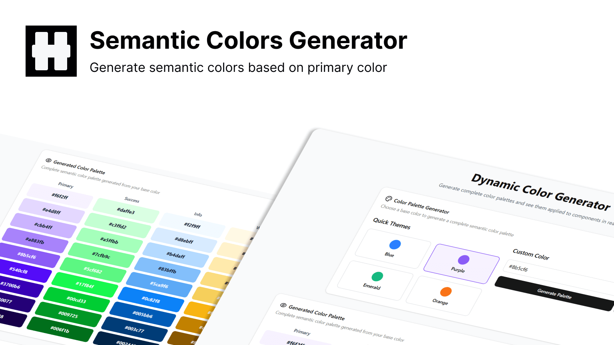

When building a white-label application, branding flexibility is key. This includes dynamically changing the **logo**, **favicon**, **fonts**, and — most importantly — **colors**.



In this post, we’ll focus only on the **TailwindCSS + Next.js** side of dynamic color theming. My stack also uses MUI, but we’ll save that for another day.

## Approach

With **TailwindCSS 4.0**, the config file is now merged into your `global.css`, making customization easier using the `@theme` directive.

We’ll define CSS variables for our colors, map them to Tailwind utilities, and then update them dynamically at runtime.

---

## 1. Define Color Variables

We’ll start by defining our color scheme inside `:root`.  
This example uses five main colors: `primary`, `success`, `info`, `warning`, and `danger`, each with shades from `100` to `900`.

```css
:root {
  --primary-100: #eef5ff;
  --primary-200: #cee1ff;
  --primary-300: #a2c7ff;
  --primary-400: #61a0ff;
  --primary-500: #2b7fff;
  --primary-600: #005be6;
  --primary-700: #0040a2;
  --primary-800: #002a6b;
  --primary-900: #001a42;

  --success-100: #d1ffe1;
  --success-200: #b1fccc;
  --success-300: #8cf3b0;
  --success-400: #59e088;
  --success-500: #2dd267;
  --success-600: #21b153;
  --success-700: #10933e;
  --success-800: #05792e;
  --success-900: #006323;

  /* info, warning, danger... */
}
````

---

## 2. Map Variables to Tailwind Utilities

In TailwindCSS 4.0, you define theme variables inside `@theme`.  
We map each shade to Tailwind’s `--color-*` format so we can use classes like `bg-primary-500` or `text-danger-700`.

```css
@theme {
  --color-primary-100: var(--primary-100);
  --color-primary-200: var(--primary-200);
  /* ...repeat for all colors... */
}
```

---

## 3. Create a Theme Context

We’ll use React’s **Context API** to store and update the color palette dynamically.

**Types:**

```ts
// color.ts
export type EvaColor = {
  primary: string[];
  danger: string[];
  info: string[];
  success: string[];
  warning: string[];
};
```

**Context:**

```ts
// color-context.ts
import { createContext } from "react";
import { EvaColor } from "./color";

export const ColorContext = createContext<{
  currentColor: EvaColor;
  setPrimaryColor: (color: string) => Promise<void>;
  error: string | null;
  clearError: () => void;
  isLoading: boolean;
}>({
  currentColor: { primary: [], danger: [], info: [], success: [], warning: [] },
  setPrimaryColor: async () => {},
  error: null,
  clearError: () => {},
  isLoading: false,
});
```

---

## 4. Implement the Provider

```tsx
// ThemeProvider.tsx
"use client";

import { useEffect, useState, useCallback, useMemo } from "react";
import { EvaColor } from "./color";
import { ColorContext } from "./color-context";
import { toast } from "sonner";

interface ErrorResponse { error: string; message: string; }
const isErrorResponse = (d: unknown): d is ErrorResponse =>
  typeof d === "object" && d !== null && "error" in d && "message" in d;

const ThemeProvider = ({ children }: { children: React.ReactNode }) => {
  const [currentColor, setCurrentColor] = useState<EvaColor>({
    primary: [], danger: [], info: [], success: [], warning: [],
  });
  const [error, setError] = useState<string | null>(null);
  const [isLoading, setIsLoading] = useState(false);

  const setPrimaryColor = useCallback(async (color: string) => {
    setIsLoading(true);
    setError(null);
    try {
      const res = await fetch(`/api/get-color?theme=${color}`);
      if (!res.ok) {
        const errorData = await res.json();
        if (isErrorResponse(errorData)) {
          toast.error(errorData.message);
          return;
        }
        throw new Error(`HTTP error! status: ${res.status}`);
      }

      const data = await res.json();
      if (!("primary" in data)) throw new Error("Invalid response format");

      const colorData: EvaColor = data;
      setCurrentColor(colorData);

      Object.entries(colorData).forEach(([type, shades]) =>
        shades.forEach((c, i) =>
          document.documentElement.style.setProperty(`--${type}-${(i + 1) * 100}`, c)
        )
      );
      localStorage.setItem("color", JSON.stringify(colorData));
    } catch (e) {
      setError(e instanceof Error ? e.message : "Unknown error");
      console.error("Error setting primary color:", e);
    } finally {
      setIsLoading(false);
    }
  }, []);

  const clearError = useCallback(() => setError(null), []);

  useEffect(() => {
    const stored = localStorage.getItem("color");
    if (stored) {
      try {
        const colors: EvaColor = JSON.parse(stored);
        setCurrentColor(colors);
        Object.entries(colors).forEach(([type, shades]) =>
          shades.forEach((c, i) =>
            document.documentElement.style.setProperty(`--${type}-${(i + 1) * 100}`, c)
          )
        );
      } catch {
        localStorage.removeItem("color");
      }
    }
  }, []);

  const value = useMemo(
    () => ({ currentColor, setPrimaryColor, error, clearError, isLoading }),
    [currentColor, setPrimaryColor, error, clearError, isLoading]
  );

  return <ColorContext.Provider value={value}>{children}</ColorContext.Provider>;
};

export default ThemeProvider;
```

---

## 5. Hook for Easy Access

```tsx
// use-color-context.tsx
"use client";
import { useContext } from "react";
import { ColorContext } from "./color-context";

export const useColorContext = () => {
  const ctx = useContext(ColorContext);
  if (!ctx) throw new Error("useColorContext must be used within a ThemeProvider");
  return ctx;
};
```

---

## 6. Wrap Your App

```tsx
// layout.tsx
import ThemeProvider from "./ThemeProvider";

export default function RootLayout({ children }: { children: React.ReactNode }) {
  return (
    <html lang="en">
      <body>
        <ThemeProvider>{children}</ThemeProvider>
      </body>
    </html>
  );
}
```

---

## 7. Color Generator API

In my setup, I use a custom color generator API:

```ts
const res = await fetch(
  `https://dynamic-color-generate.heterl0.live/api/get-color?theme=${color}`
);
```

For production-grade results, you might consider:

- [Eva Design System Color Generator](https://colors.eva.design/) (paid)
    
- Your own algorithm for generating color shades
    

---

## Conclusion

With this approach, you can dynamically change TailwindCSS colors in your **Next.js** app at runtime — perfect for white-label solutions.

Check out my tool here:  
[Dynamic Color Generate](https://dynamic-color-generate.heterl0.live/)
