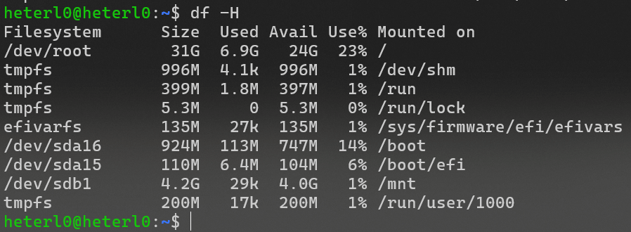

## Introduction

After running my backend server on an Azure Student VPS for about three months with a $100 budget, I started looking for a cheaper, long-term solution. My goal was to find a VPS that costs around **$5–$10 per month** and is easy to maintain for small projects.


Here’s how I migrated my **Dockerized Django backend** from Azure to another VPS, and what I learned from the experience.

---

## My Azure VPS Specs


I used Azure's student subscription for three months. Here were the server specs:

- **1 vCPU**
- **2 GB RAM** (no swap)
- **32 GB SSD**
- OS: Ubuntu Server
- Services: MySQL, Nginx, Redis, Python (Pipenv), Git


```bash
htop
````



```bash
df -H
```

I found that this configuration worked well for my small backend. So, I looked for a similar VPS spec in a more affordable price range.

---

## Researching Affordable VPS Options

I checked several providers and compared their plans:

|Provider|Price (USD)|Price (VND)|Specs|
|---|---|---|---|
|Vultr|$10.00|249,300 VND|1 vCPU, 2 GB RAM|
|CloudCone|$5.78|144,095 VND|1 vCPU, 2 GB RAM|
|Scaleway|$3.41|85,011 VND|1 vCPU, 2 GB RAM (pre-tax)|
|OVH|$0.97|24,182 VND|(Very basic specs)|
|Hetzner|$4.79|119,415 VND|1 vCPU, 2 GB RAM|

> _That is the result was returned by Perplexity, and I do not confirm the research yet! _

I also looked at **VinaHost**, a local Vietnamese provider. Their VPS offers:

- **3 vCPU**
    
- **3 GB RAM**
    
- Cost: **250,000 VND/month** (pre-tax)
    
- 50% discount for 6–12 month subscriptions
    

With the discount, I paid **~~125,000 VND/month (~~$5.10 per month)** for 6 months. This plan gave me more resources at a cheaper rate — within my budget and flexible enough to adapt to future growth or changes.

---

## Why I Dockerized My Backend

Each time I moved my backend before, I had to manually reinstall and configure everything:

- Git
    
- MySQL
    
- Python + Pipenv
    
- Nginx
    
- Redis
    
- SSL with Let's Encrypt
    

It was **time-consuming and error-prone**.

So, I decided to **Dockerize my Django backend**. I had some experience using Docker from my company’s projects (NestJS backend), where we used `docker compose` to run dev and prod environments easily.

I also learned that some **frontend job interviews** ask about Docker — so it’s a good skill to have.

> I plan to write another blog post specifically on **Dockerizing a Django backend** soon.

---

## Migration Steps

I documented my process for migrating the backend from Azure to the new VPS.

### ✅ On the Old VPS

1. **Backup the MySQL database** to a `.sql` file.
    
2. **Backup Let's Encrypt** certificates.
    
3. **Save the Nginx configuration**.
    
4. **Write `Dockerfile` and `docker-compose.yml`**.
    
    - I used **Claude** AI to help generate the base files.
        
    - I modified them to fit my tech stack (Django, MySQL, Nginx, Redis).
        
5. **Test the Docker setup** on my local machine using WSL on Windows.
    
    - Everything worked smoothly, so I proceeded with the migration.
        

---

### 🚚 On the New VPS

1. **Bought the new VPS** from VinaHost.
    
2. **Set up GitHub SSH** to clone my project repo.
    
3. **Set up MySQL container** and created the database and user.
    
4. **Imported the `.sql` backup** into the database container.
    
5. **Ran `docker-compose up -d`** to start the app stack.
    
6. **Handled Nginx conflict:**
    
    - The VPS already had Nginx running on port 80.
        
    - I deactivated the VPS-level Nginx service before using the containerized one.
        
7. **Pointed the domain DNS** to the new VPS IP.
    
8. **Restored SSL certificates** from the backup.
    

Boom — my backend was live again!

---

## Final Thoughts

This was my first time using Docker to migrate a server, and it made the process much easier and faster.

- No more manually setting up services
    
- Easy to test locally with `docker compose`
    
- More flexibility to scale or move in the future
    

Thanks to **VinaHost’s 50% discount**, I got a **3GB RAM / 3vCPU VPS for just ~$5.10/month**, well within my budget.

---

## Feedback Welcome!

I’m still new to Docker, so if you notice any mistakes or have suggestions, feel free to leave a comment. I'd love to learn and improve my setup.

Thanks for reading! 🚀