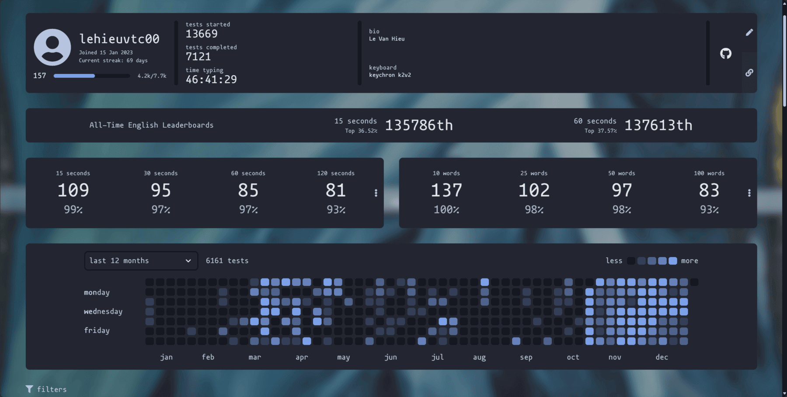

## Introduction
I am practice [Touch Typing](../touch-typing) around **69 Days streaks**.

From the last time I have updated Nov 22, my typing speed is increased. I have achieve the goal to get the avg speed around 80 - 90 wpm. I am really happy and ...proud of myself for reaching this milestone! The past few months have been a journey of consistent practice and dedication, and it's amazing to see how much progress I've made.

Look at the graph above, which shows my typing speed over time. As you can see, the typing speed fall into around 80 - 90 is the mod of entire graph.
## Feedback
### Achievements
First of all, I will talk about what I get:
- Improve the avg speed of typing
- Improve the acc of typing speed
- With just 2 - 3 time test typing to achieve typing speed around 80 - 90. This means that I improved the efficiency and accuracy of my typing skills, allowing me to reach the desired speed in a shorter amount of time.

### Challenges
Now, let's discuss what I'm struggling with:
- Maintaining consistency: Although I've seen significant progress, I still experience fluctuations in my typing speed. Some days I'm able to hit 90 wpm easily, while others I struggle to reach 80.
- Typos and errors: Despite improving my accuracy, I still make mistakes when typing quickly. This can be frustrating and impacts the overall quality of my work.
- Through out 1 months I just get more than last month from 108 to 109
=> I'm excited to share the progress I've made in improving my typing speed and accuracy.

### Next Goal
In the next 1 month, I want to pushover myself to 90 - 100 avg speed and get the better score in typing.
