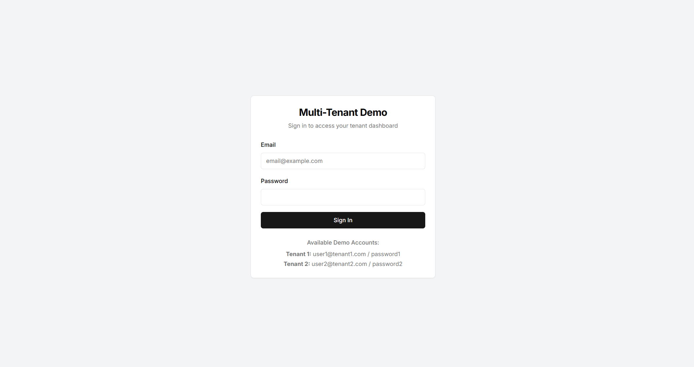

## What is Multi-Tenant Architecture?

Multi-tenancy is a software architecture where a single instance of an application serves multiple tenants (customers or users). Each tenant's data is logically isolated, ensuring privacy and security while sharing the same infrastructure, such as servers, databases, or applications. This model is widely used in SaaS platforms like Salesforce, Google Workspace, and Dropbox.

Key features of multi-tenancy:

- **Shared Infrastructure**: Tenants share the same hardware and software resources.
- **Tenant Isolation**: Data and configurations are isolated for each tenant.
- **Cost Efficiency**: Shared resources reduce costs compared to single-tenant setups.
- **Scalability**: Easily accommodates more tenants by leveraging shared resources.

---

## Building a Multi-Tenant Application with Next.js

Checkout [Demo](https://login.heterl0.live/)



This section outlines how to create a multi-tenant application using Next.js with subdomain-based tenant separation (e.g., `tenant1.yourdomain.com`, `tenant2.yourdomain.com`).

### Folder Structure

Organize your Next.js [project](https://github.com/heterl0/nextjs-multi-tenant-with-auth) as follows:

```plaintext
| 
├── app/
|   ├── [subdomain]/     # Tenant-specific subdirectory
|   │   ├── page.tsx     # Main page for the tenant
|   │   ├── layout.tsx   # Layout for tenant pages
|   └── middleware.ts    # Middleware for request handling
| public/
|   └── images/tenant1/  # Tenant-specific static assets
| package.json           # Project configuration
| .env                   # Environment variables
```

---

### Middleware for Subdomain Handling

The middleware handles routing, authentication, and request rewriting based on subdomains. Below is the `middleware.ts` code:

```typescript
import { NextResponse } from "next/server";
import type { NextRequest } from "next/server";
import { domain } from "@/lib/env";

export function middleware(request: NextRequest) {
  const hostname = request.headers.get("host") || "";
  const url = request.nextUrl.clone();
  const tenantSlug = hostname.split(".")[0];

  if (hostname === domain || hostname === domain.split(":")[0]) {
    return NextResponse.redirect(new URL(`http://login.${domain}`));
  }

  if (tenantSlug === "login") {
    if (url.pathname !== "/" && url.pathname !== "/api/login") {
      return NextResponse.redirect(new URL("/", request.url));
    }
    return NextResponse.next();
  }
  
  // In this example for easy auth I use userId as cookie auth Token
  const userId = request.cookies.get("userId")?.value;
  if (!userId && tenantSlug !== "login") {
    return NextResponse.redirect(new URL(`http://login.${domain}/`, request.url));
  }

  url.pathname = `/${tenantSlug}${url.pathname}`;
  return NextResponse.rewrite(url);
}

export const config = {
  matcher: [
    "/((?!_next/static|_next/image|favicon.ico).*)",
  ],
};
```

---

## How It Works

1. **Subdomain Detection**:
    - The middleware extracts the subdomain from the `host` header to identify the tenant.
2. **Authentication**:
    - If no `userId` cookie exists, users are redirected to the login subdomain (`login.yourdomain.com`).
3. **Route Rewriting**:
    - Requests are rewritten to serve tenant-specific pages under `/[subdomain]`.
4. **Cookie Management**:
    - The login flow sets a `userId` cookie upon successful authentication.

---

## Steps to Implement

1. **Domain Configuration**:
    - Point your main domain and all subdomains to the same server.
2. **Environment Variables**:
    - Define your root domain in an `.env` file (e.g., `DOMAIN=yourdomain.com`).
3. **Local Development**:
    - Use host aliases or local DNS tools to test subdomains locally (e.g., `127.0.0.1 login.localhost`).
4. **Authentication Flow**:
    - Create a login page at `login.yourdomain.com` that sets a cookie (`userId`) upon user authentication.
	    > **Note:** In the practice, we use `JWT` or cookie instead. cross-domain can't maintain the cookie, so I pass it through by using query params.
5. **Tenant-Specific Pages**:
    - Build tenant-specific pages in the `[subdomain]` directory under `app`.

---

## Advantages of This Approach

- **Scalability**: Easily add new tenants by creating new subdirectories.
- **Isolation**: Each tenant has its own namespace and data separation.
- **Flexibility**: Middleware allows dynamic routing and authentication handling.

This setup ensures a robust multi-tenant architecture using Next.js while maintaining security and scalability through subdomain-based isolation and cookie-based authentication.

## Disclaimer 

The approach described in this blog post is based on my personal experience with a past project and may not be the most effective or efficient method for implementing multi-tenancy. While it draws inspiration from various sources, including [How to Build a Multi-Tenant App with Custom Domains Using Next.js](https://vercel.com/guides/nextjs-multi-tenant-application), it's important to note that this approach lacks robust authentication when users navigate to subdomains. For more comprehensive and up-to-date solutions, consider exploring other resources or official documentation. If you're interested in my other projects, you can check out my GitHub profile at [https://github.com/heterl0/](https://github.com/heterl0/).

## Reference
1. [How to Build a Multi-Tenant App with Custom Domains Using Next.js](https://vercel.com/guides/nextjs-multi-tenant-application)