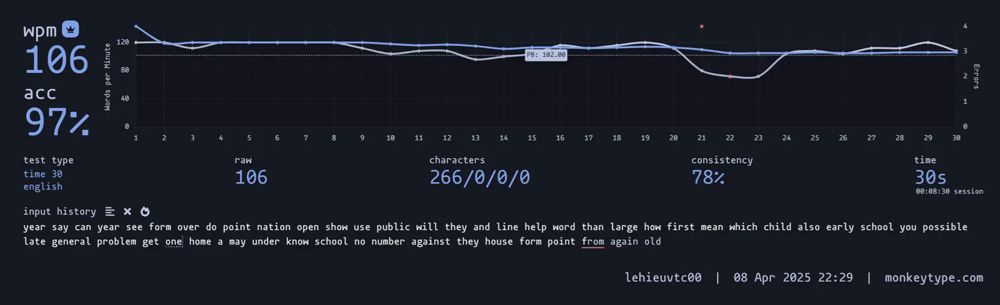
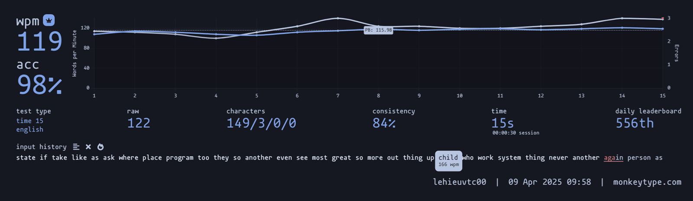
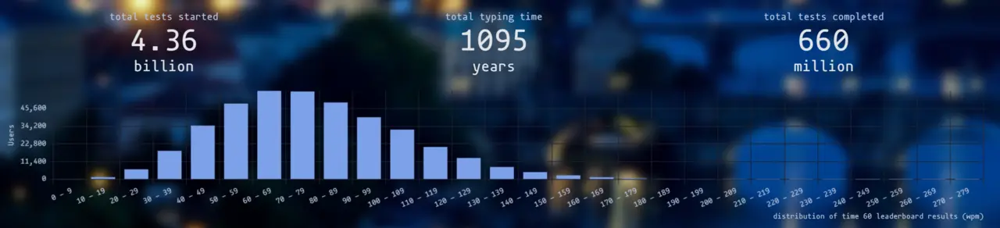

## 🚀 Update Process

Today is April 13th, 2025. I’m writing this blog to update my touch typing practice journey for this month. As of today, I’ve maintained a **168-day streak** on MonkeyType. It’s been a long road, and I’m genuinely proud of myself for staying consistent and tracking every step of the way.

This month, I hit **two new personal records**, and I’m super excited to share them with you!

---

Over the past few weeks, I’ve increased my daily practice time to **25 minutes per day**, switching between 15s and 60s sessions. I mentioned this change in my previous update. However, even after dedicating more time, I started to feel like my results weren’t improving much. That made me feel a bit down.

When I checked the weekly leaderboard, I saw some users with over **450 hours of practice** still typing around 60 WPM, and others with **400–500 hours** at about 100 WPM. It reminded me that I started this journey without a clear goal. I didn’t have any friends to practice with or share progress, and honestly, I didn’t even know why I was doing it at first.

When I’m coding, I don’t use my maximum typing speed — not 100 WPM, not even 80 or 90. Programming requires thinking and planning, not just speed. I’ve also noticed that the faster I try to go, the more mistakes I make. That really got me thinking.

Looking at my distribution, my 90–100 WPM range puts me in the top 20% of users. But I don’t aim to be the best. I just want to be a good, steady developer.

---

## 🔜 Upcoming Changes

Moving forward, my goal is simple: **do 1% better than yesterday** — even on tough days when I don’t feel motivated. I’ve decided to **reduce my typing practice to around 10 minutes per day**. I’ll use the extra time to focus on other goals I care about.

During typing sessions, I’ll **prioritize accuracy over speed**. In fact, both records I broke this month happened when I consciously slowed down and focused on precision instead of rushing.

Thank you for reading my blog.

Feel free to check out more posts at [heterl0.live](https://heterl0.live/), follow my projects on [GitHub](https://github.com/heterl0), or subscribe to updates via [RSS Feed](https://heterl0.live/feed/feed.xml).

**Happy typing! 🌟**