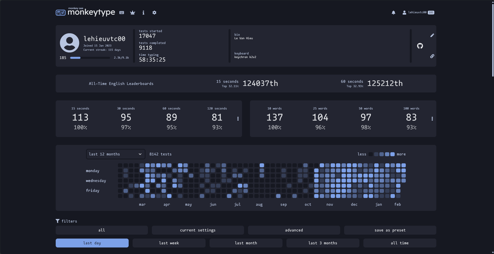

## **Update Process** 📝

It's been **1.5 months** since my last blog post about my **typing speed update** ([update process](../new-process-update)). My goal was to **increase from 80-90 WPM to 90-100 WPM**, but it's still too hard for me.

Currently, my **average speed is around 87 WPM**, and my accuracy hasn't improved much. I haven’t reached my target yet, which is frustrating. I've been **practicing regularly**, but progress isn’t as **fast** or **consistent** as I hoped.

In **1.5 months**, I practiced for about **12 hours**. It’s **not a lot**, but at least I kept it **consistent**. Some days, I only practiced for **10-15 minutes** or even **less**, and I’m not happy with that. I should focus on **more structured and steady** practice.

Another thing that makes me **disappointed** is that my **max speed hasn’t improved at all**. It’s the same as before, and that **frustrates me**. Progress feels **stuck**, which makes it harder to stay motivated. 😞

To **break through this plateau**, I need to **change my approach** and find out what’s holding me back.

---

## **New Goal 🎯**

For the **next month**, I’ll try a **new practice strategy**. Instead of relying on **long sessions**, I’ll focus on **short but frequent practice**.

💡 **New Plan:**  
✔ **Increase practice time** to **25 minutes per day**  
✔ **Take 5-10 minute breaks** between sessions  
✔ **Track my progress** and identify weak areas  
✔ **Stay consistent and adjust when needed**

By practicing **in shorter bursts**, I can keep my **focus** and **stamina** without feeling too tired. This will **help me improve** without burning out. 🔥

🔍 **Tracking my progress** will also help me see where I struggle, so I can adjust my practice **more effectively**.

📌 **Summary:**  
✔ **More frequent but shorter practice**  
✔ **Daily routine with breaks**  
✔ **Track progress & adjust as needed**

This time, I’ll focus on **staying motivated and improving step by step!** 🚀💪