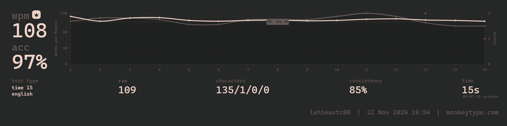

## About *Touch Typing*
Touch Typing is a technique that allows you to type on a keyboard without looking at it. This technique requires you to develop muscle memory by placing your fingers on the home row keys (the middle row of keys) and then practicing typing exercises to learn the correct finger placement for each key.

## Benefits of Touch Typing
Touch typing offers several benefits, including increased speed, accuracy, and efficiency when typing. By developing this skill, you can type quickly and accurately without distractions, making it an essential tool for anyone who spends a significant amount of time on computers, smartphones, or other devices.

## How to Learn Touch Typing
That is how I start:
*   Start with short exercises, such as typing single keys or simple phrases.
*   Gradually increase the complexity of your exercises by adding more characters and words.
*   Practice regularly to build muscle memory and improve your skills.
*   Consider using online resources, tutorials, or software designed specifically for touch typing.

## Learning Process
### In The Past
I have start to learn this technique from I am in high school. In the past, I have typing with speed at around **50-60 words per minute (wpm)**, but it's been a while since I've practiced regularly.
I have practiced everyday to achieve not looking at the keyboard while I was typing.
### Currently
About 1 months ago, I have started to learn this technique again. I can typing about 60 - 70 ... words per minute (wpm). However, I still need to practiced to achieve the better speed.
Thought this one months, I spent about 10 to 60 minutes a day practicing touch typing exercises  in [Monkeytype](https://monkeytype.com/)

I've noticed that my speed and accuracy have improved slightly over the past month achieve the average speed at 73-77 wpm ...with a noticeable decrease in errors. However, I still feel that I'm not utilizing my full potential, and there's room for improvement.

I plan to continue practicing consistently and incorporate more challenging exercises into my routine. I'll also explore other resources and software to supplement my practice and potentially accelerate my progress. My goal is to reach a typing speed of at least 80-90 wpm, with minimal errors and the ability to type accurately without looking at the keyboard.

To achieve this, I'll focus on:
*   Increasing my daily practice time to 30-60 minutes or more, depending on my schedule
*   Exploring different typing exercises and games to keep my practice sessions engaging and challenging
*   Analyzing my mistakes and focusing on correcting them specifically, rather than just practicing randomly
*   Setting realistic goals for each week/month and tracking my progress to stay motivate

